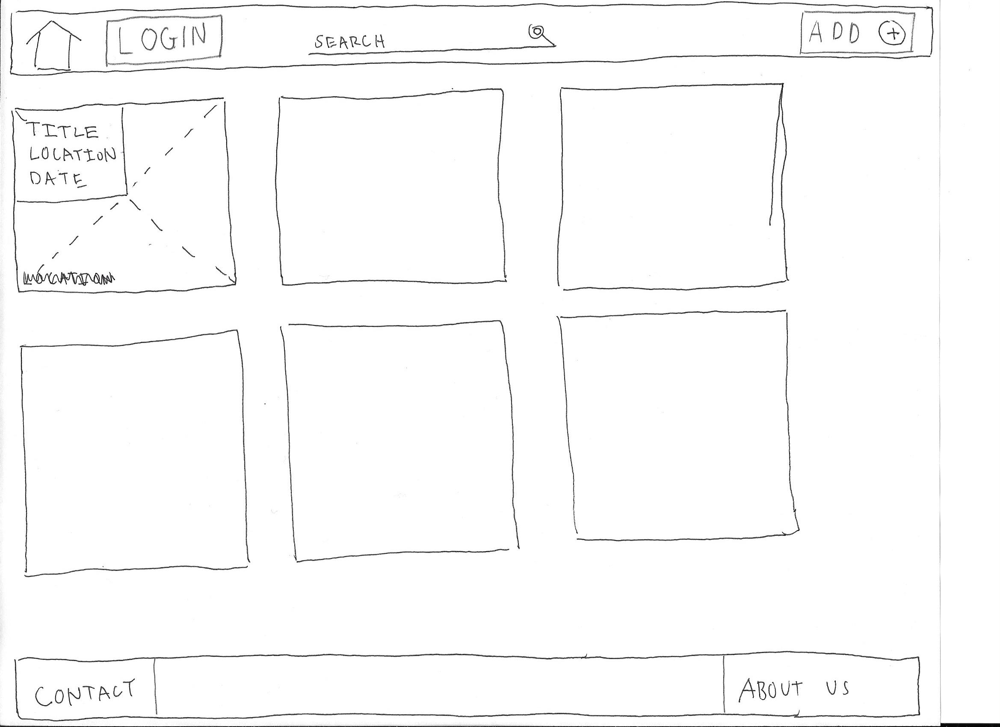
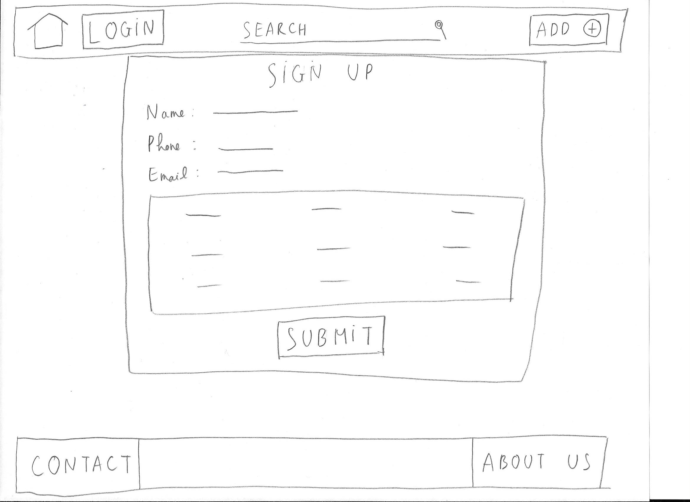
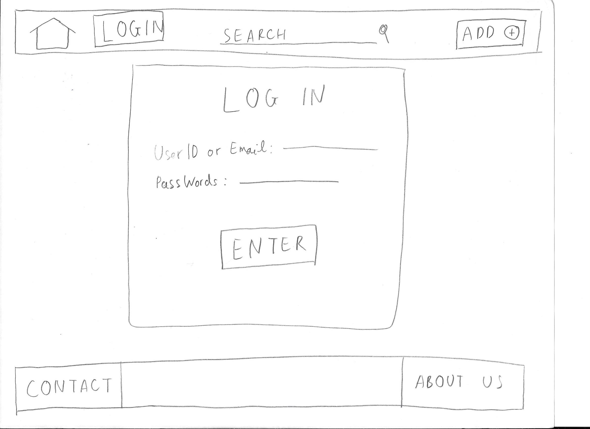
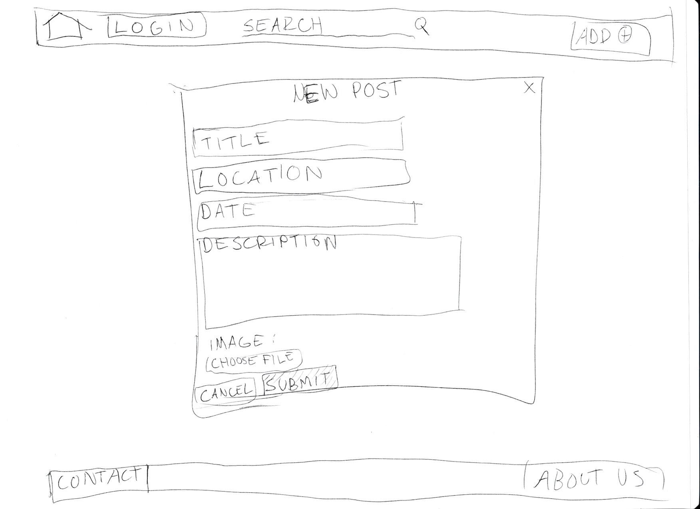

## Problem Statement:

Students, especially Freshmen upon coming to UW, are unaware of the free resources that the campus provides that are available to them. The free resources help reduce additional cost for students who are living in a frugal fashion to maintain their financial budgets. To get the most out of college life, resources that do not require additional money spending should be taken advantage of because tuition and living expenses are already expensive enough. Taking advantage of these resources will save them a lot of money and give them a head start on their education at UW. To solve the problem, our mission is to help students navigate all the resources that UW campus has to offer.

In a study done about collegiate resources and college completion, it was found that the less resources there were per student, there is a lower rate for students for completing a Bachelor’s degree. There has been a rise in college enrollment, but the completion rate has not been proportionate. Instead, there has been a decline in the completion rate. This an alarming trend, since we should expect the rate to be proportionate.

https://pubs.aeaweb.org/doi/pdfplus/10.1257/app.2.3.129

Students lose opportunity due to limited resources in their school. This problem is especially worse for people located in areas of concentrated poverty. Based on a report there has been worse outcomes (low test scores and college enrollment) for those faced with poverty. Although this report is about high school students, it shows significance on how a lack of resources affects success.

https://www.thecommonwealthinstitute.org/2017/10/26/unequal-opportunities-fewer-resources-worse-outcomes-for-students-in-schools-with-concentrated-poverty/

## Solution:

Our solution will be in the form of a responsive web page in efforts to cater to a diverse audience. We chose a responsive web page because it will support Windows, Mac, and iOS. All of which are popular operating system platforms that majority of users use. To promote the use of accessibility and ease of access, our solution will provide a mobile-first design approach. Being able to access quick information regarding free stuff on campus, the higher the chance in acquiring free resources. The solution will provide quicker access to information and recent updates to where free resources are being passed. Thus, students will become more aware of the resources that are available to students so that they can take advantage of them.  

Solution Priorities:

Correctness: We have to make sure that the website would work properly and exactly as we prescribe in our design. Also, we have to make sure that the program we’re implementing doesn’t have an unexpected action.

Reliability: our website need to work properly without crashing too often.

Performance: We expect the search feature to work fast.

Learnability: We want users to learn to use the website really fast with minimal time to learn or time to do research what the website do.

Usefulness: We expect the website to beneficial to users (students) in UW.

### Features:

Dashboard:

The dashboard will be the default page when the user sees upon login. Here, the user will see posts in regards to free resources/free stuff that’ll be posted by other students/users across campus. The posts are displayed in card view.

  

Home Button:

If the user clicks on the home button at the top left of the page, the user will be brought back the dashboard default page with any new update.

The home button will be present for all pages during any interactions with users.

Search:

Search bar will be located on the top-mid section of the page

User does not need to be signed in to use search functionality

The user inputs a term and the dashboard is filtered out to show the posts that contain the term. The search looks at titles, descriptions, and locations.

Will have a query string and a textfield to type query

Query will filter down results given user input, meaning that results will load based on user input from search functionality

When none of the posts contain the input, the user is prompted that no results were found.

Login/Sign up:

If not signed in, website will display Login/SignUp

Clicking on the “Login/SignUp” button at the top opens up a modal where the user provides login credentials.

Log-in Component allows user to log into their account

Prompt with “Enter your email” or “Enter your password”
User will input an email
User will input a password
Both Require text fields
Check if username and password is correct
If correct, signs the user in
If incorrect, an error message will be given invalid username/password
If no fields, or any field for that matter is blank, and is submitted, website will return an error message

Sign-up is located near the bottom of the modal. The user provides information (email and password) when creating an account. Sign-up page will be in a different page, away from the main page.

Prompt the user to type in an email, phone, password, and password confirmation all of which require a textfield
Password confirmation is to double-check if user has typed their intended password and if it doesn’t match, an error message will be displayed
If email does not match, the user will be shown an error message
If any fields appear to be blank, an error message will be shown

Being logged in gives users the ability to create posts, replacing the log in with username and sign out button

  
  

Create Post:

Users are able to create posts to share any resources by clicking the “Add Post” button. If the user has not logged in, she/he will be transferred to Login/Sign up page.
When creating a post, a modal pops up and the user provides information for the post. 
The modal will prompt the user to add their title, description, location, and optional picture
Prompt user to add type in a title, description location, and date
Title, Description, Location, and Date will put textFields
If any fields appear to be blank, an error message will be shown
Optional picture will require a fileSelector to allow users to select an image from their end of the device
Clicking submit without any information prompts the user to fill in the missing fields(optional picture is excluded from this prompt).
After successfully submitting, the dashboard is updated with the user’s post.
If the user clicks cancel or the ‘X’ located on the top right of the modal, users are prompted to confirm if they want to close by a pop-up indicating “yes” or “no”. If yes, the modal disappears and the original screen(dashboard) behind will be shown. If no, the yes/no prompt will disappear and the pop-up modal will be shown back again.

  

Editing Post:
The posts can only be edited by the posting login user and the administrators.
When clicking on a post, the user who created the post will have an option to edit it at the bottom at the post. After clicking it, the user will be transferred to a new page which look similar to the create post and she/he can start editing the post. After the user clicks summit, the post will be updated from the database. And the user will be shown back to the dashboard default page with the updated post. If the user clicks “cancel”, she/he will be shown back to the dashboard default page with nothing happen.
The administrators also have the power to edit the post. When the administrator clicks on a post on the dashboard page, the option to edit the post will also show at bottom at post modal just like the posting user. The administrator will edit the post following the same procedure like above.
For the time being all past post that has been edited will not show any history of the editing. And there will be no record of the past posts which is stored in the database. All posts edit to the current time with past information is gone.

Delete Post
The posts can only be deleted by the posting login user and the administrators.
When clicking on a post, the user who created the post will have an option to delete it at the bottom at the post. After clicking it, there will show a message asking if the user really want to delete the post, “yes” or “cancel”. If user clicks “yes”, the post will be removed from the database. And the user will be shown back to the dashboard default page with the update without the post. If the user clicks “cancel”, she/he will be shown back to the dashboard default page with nothing happen.
The administrators also have the power to delete the post. When the administrator clicks on a post on the dashboard page, the option to delete the post will also show at bottom at post modal just like the posting user. The administrator will delete the post following the same procedure like above.
For the time being all past post that has been deleted will not show any history of the deletion. And there will be no record of the past posts which is stored in the database. All posts delete to the current time with past information is gone.

Tile Grid Display
Once create post is created by the user, the website will refresh and their post will be added to the right side of the screen
A singular Tile will display its title, location, date on the upper left hand side, and picture as it’s background. If no optional picture is uploaded by its user, then there will be a default picture automatically uploaded with the post
Title, Location, and Date will be a textLabel
Image will be an image
Tile will be a button itself with an event listener that will respond to a click to have a modal pop up for additional information
Tile will contain width and length - this will determine how many tiles to display horizontally and vertically
Tile display will be sorted by left to right(grid) by the time it was created for its default view
The more recent the post is, the more left the card will be positioned
Scrolling down on the card display will see cards that are posted later

Interacting with Post
When the user clicks on a post on the dashboard, a modal pops up. The modal shows information about the post. The information includes a title, location, date, picture and description.
Clicking the location in the modal opens up a new tab to the location on Google Maps.
Users can remove visibility on posts for themselves by clicking the ‘X’ on the top right of a post
Closing a Modal:
Users can close the modal by click out of the modal or clicking the ‘X’ on the top right corner of the modal. If the user clicks anywhere else, the model will not close.

Database
Database on our backend will contain User objects
Stores information about user credentials and their personal posts
Delete Post
Footer
The right side of the footer will contain a ‘contact’
Contact will contain href links to personal linkedIn accounts
Left side of the footer will contain an ‘about us’ section
About us will give a brief description of what our product functions as. It aims to tackle a problem and provides an intuitive solution

Points of Interaction:

Create Post
Create Title of Post
Create Date of Post
Create Location of Post
Create Description of Post
Optional Upload of Picture 
Delete Post
Click on Post

## User Feedback: (from Jimmy’s interview)

From the user that we have interviewed which we will named Mark (omitting the name of the interviewee due to privacy reason), he is a third-year student who majors in Biology. The interview was conducted in Odegaard Library for 20 minutes. The idea of the project seems very interesting to him. The design of the website is very simple that he can navigate through it without much trouble. Thanks to him, we also get out of some very interesting feedback. For one, the add button on our site originally only include a plus button with no “Add” word on it. He thinks that it was quite confusing for what purpose is this button do. So, our team decide to include to the word “Add” to give it some context. Moreover, he advises us to add more feature that can improve interaction with users more like notifying the users if a new post is added. He also hopes that we can add filter feature base on time beside key words on the search function. One more interesting perspective that we got from the interview is that we should have a marketing plan in place to make sure the website a success if we decide to launch it, like how would we advertise to students for example.

## Our thoughts after the interview:

we really appreciate the inputs from Mark. He gives us some good suggestions. But, for the time being, we will only focus on the tasks which were prescribed by the design. We would not add more features like notification because it would make our project too big to be accomplished for the time being. We also will not worry about marketing the product for now. Instead, we hope to create the minimum functioning website that can be used true to our design. If we have more time at the end of the quarter, we will continue to improve the product further. This decision is because we have little time to explore all possibilities; meeting the deadline is a constraint we must follow.

