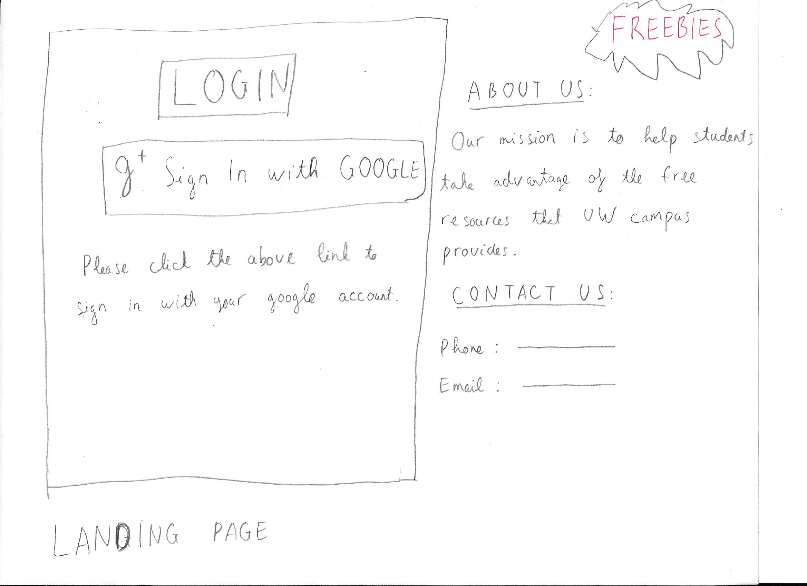
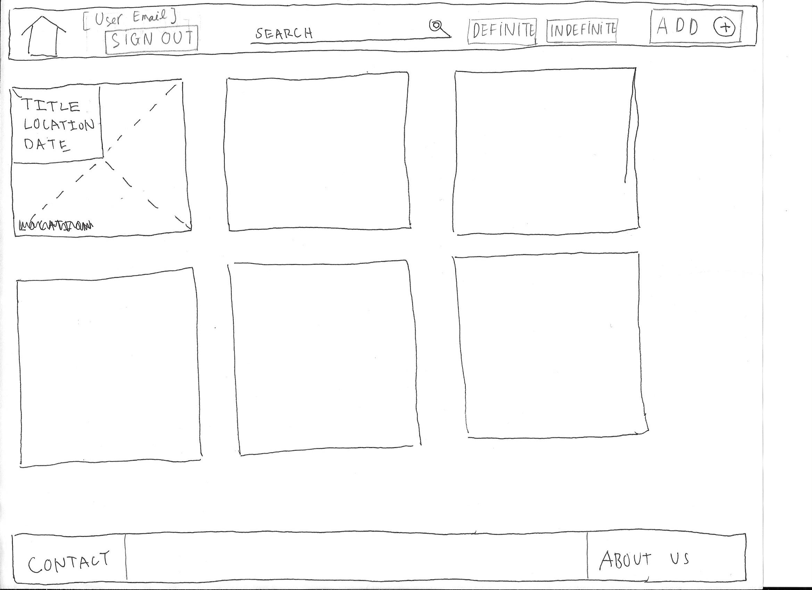
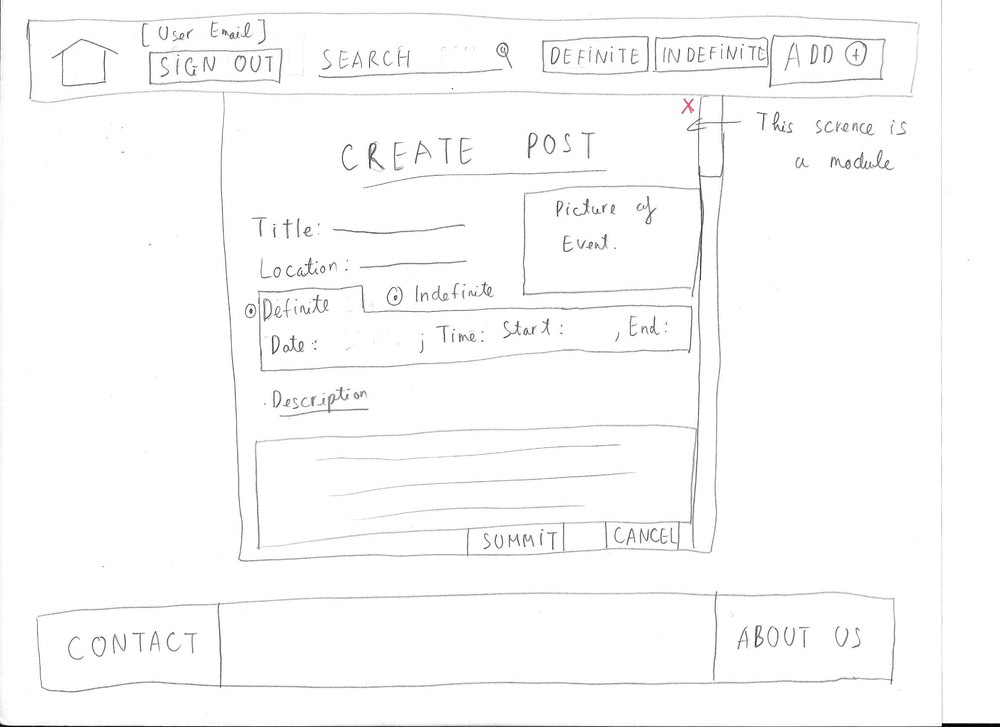
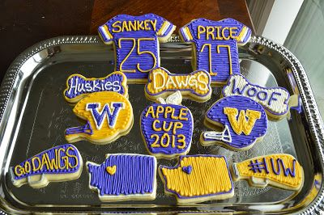
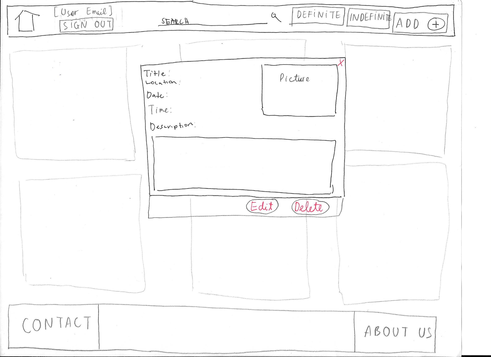
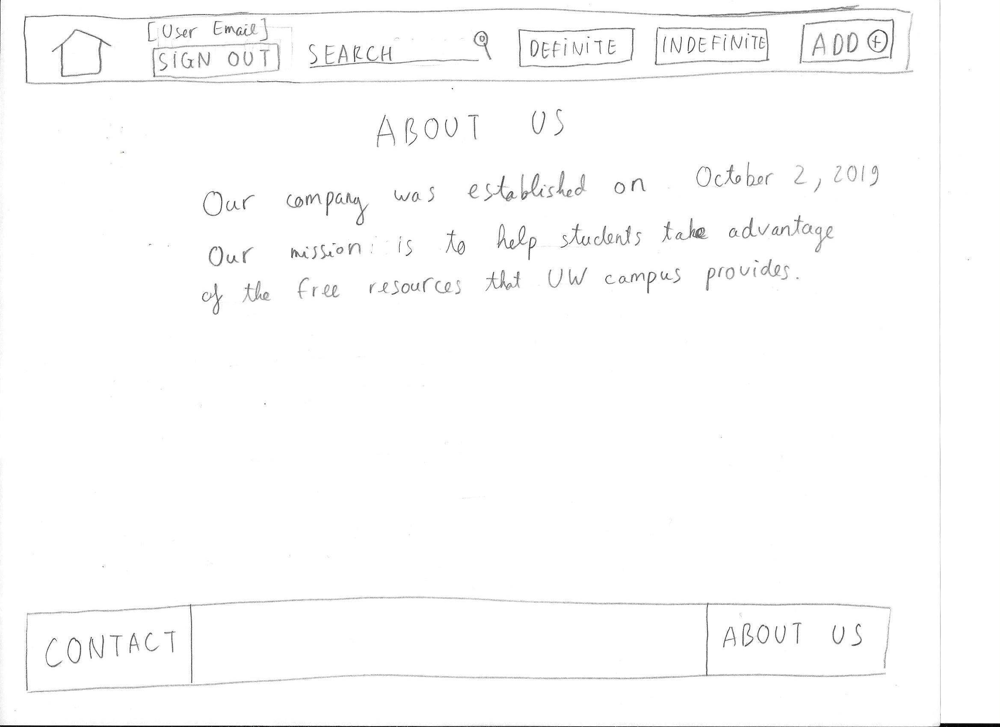

## Problem Statement:

In a [study done about collegiate resources and college completion](
https://pubs.aeaweb.org/doi/pdfplus/10.1257/app.2.3.129) (Bound, 2010), it was found that the less resources there were per student, there is a lower rate for students for completing a Bachelor’s degree. There has been a rise in college enrollment, but the completion rate has not been proportionate. Instead, there has been a decline in the completion rate. This an alarming trend, since we should expect the rate to be proportionate.

Students lose opportunity due to limited resources in their school. This problem is especially worse for people located in areas of concentrated poverty. Based on a [report on unequal opportunities for students in high school](https://www.thecommonwealthinstitute.org/2017/10/26/unequal-opportunities-fewer-resources-worse-outcomes-for-students-in-schools-with-concentrated-poverty/) (Duncombe, 2017), there has been worse outcomes (low test scores and college enrollment) for those faced with poverty. Although this report is about high school students, it shows significance on how a lack of resources affects success. It can be seen that resources affect the success of students. With the lack of resources, there is a lowered rate of success. In order to mitigate this, it is important to provide students with access to free resources.

Students, especially Freshmen upon coming to UW, *are unaware of the free resources that the campus provides that are available to them.* The free resources help reduce additional cost for students who are living in a frugal fashion to maintain their financial budgets. Information regarding these resources are often scattered on different platforms, making it difficult to find. UW does cover the UW affiliated resources, but do not cover resources that are being provided from student organizations and other groups. To get the most out of college life, resources that do not require additional money spending should be taken advantage of because tuition and living expenses are already expensive enough. Taking advantage of these resources will save them a lot of money and give them a head start on their education at UW. **To solve the problem, our mission is to help students navigate all the free resources that UW campus has to offer.**

## Solution:

Our solution will be in the form of a responsive web page in efforts to cater to a diverse audience. We chose a responsive web page because it will support Windows, Mac, and iOS. All of which are popular operating system platforms that majority of users use. To promote the use of accessibility and ease of access, our solution will provide a mobile-first design approach. Being able to access quick information regarding free stuff on campus, the higher the chance in acquiring free resources. The solution will provide quicker access to information and recent updates to where free resources are being passed. Thus, students will become more aware of the resources that are available to students so that they can take advantage of them.

Our solution consists of a crowdsourcing hub, which allows users to share free resources that have found. We decided to use crowdsourcing instead of UW as the source of information because we wanted to make sure that there is information about what users are interested in. Sometimes, it can be difficult to share where you can get free resources from. Resources might last an hour and some might last for a few days. Using crowdsourced information will allow for a convenient way of sharing information. If the information was sent through UW then it would take some time for it to go through the system and be posted.

### Solution Priorities:

1. Correctness: We have to make sure that the website would work properly and exactly as we prescribe in our design. Also, we have to make sure that the program we’re implementing doesn’t have an unexpected action.

2. Reliability: our website need to work properly without crashing too often.

3. Performance: We expect the search feature to work fast.

4. Learnability: We want our website to be simple and for users to learn to use the website easily.

5. Usefulness: We expect the website to beneficial to users (students) in UW.

### Features:

**Login:**
* The log in/landing page will be split into two halves, vertically down.
	* On the left side of the page, the top middle will show a ‘login’ text and below it will it will have a google sign in button. The button will be aligned in the middle on the left side. The button will say “g+ Sign in with google”. Below will give instructions on how to log in and also aligned with the google sign in button. “Please click the above link to sign in with your google account”
	* On the middle/top right side will display text that says ‘about us’. Under that will display a brief amount of text that discusses who we are. Below that will display text that says ‘contact us’, providing our phone number and email 
* Log In Button will require integration of google sign-in (and is handled by google themselves)
* If the User presses on the google sign in button, a new window opens up showing which google account you want to log in with
* User will click an account that is on the list and the window will close
* User will be logged in under their google account.
* If intended email is not listed on the list of accounts, an option to add account button is located on the bottom 
* If there are no errors during the login process, the user is signed in and directed to the dashboard. 
* If the user clicks on the sign out button, the user will be signed out and the log in will appear back in their original position. 
 Signed out user will be be directed back to the landing page. 

  

**Dashboard:**
* The dashboard will be the default page when the user sees upon login. Here, the user will see posts in regards to free resources/free stuff that’ll be posted by other students/users across campus. The posts are displayed in card view.
* Posts will follow the Grid Display.

**Tile Grid Display:**
* Once create post is created by the user, the website will refresh and their post will be added to the right side of the screen
* A singular Tile will display its title, location, date on the upper left hand side, and picture as it’s background. If no optional picture is uploaded by its user, then there will be a default picture automatically uploaded with the post
	* Title, Location, and start and end Date will be a textLabel
	* On the bottom right of the tile, will display and upvote/downvote system to legitimize posts
	* Tile will be a button itself with an event listener that will respond to a click to have a modal pop up for additional information
	* Tile will contain width and length - this will determine how many tiles to display horizontally and vertically
* Tile display will be sorted by left to right(grid) by the time it was created for its default view
* The more recent the post is, the more left the card will be positioned
* Scrolling down on the card display will see cards that are posted later

  

**Home Button:**
* If the user clicks on the home button at the top left of the page, the user will be brought back the dashboard default page with any new update.
* The home button will be present for all pages during any interactions with users.

**Search:**
* Search bar will be located on the top-mid section of the page 
* The user inputs a term and the dashboard is filtered out to show the posts that contain the term. The search looks at titles, descriptions, tags, and locations.
	* Will have a query string and a textfield to type query
	* Query will filter down results given user input, meaning that results will load based on user input from search functionality
* When none of the posts contain the input, the user is shown closest relevant searches based on the search term. 

**Definite/Indefinite Button:**
* There will be two radio buttons located after the search bar, lined up horizontally
* The first button will be the definite and the second will be the indefinite
* The definite button will be automatically filled as default
* When the user clicks on one of the buttons, the button will fill, and will follow the grid display (check grid display). The dashboard will display the respective type (definite/indefinite) that is selected

**Create Post:**
* Users are able to create posts to share any resources by clicking the “Add Post” button. If the user has not logged in, she/he will be transferred to Login/Sign up page.
* When creating a post, a modal pops up and the user provides information for the post. 
* The modal will:
	* Prompt the user to add their title, description, location, tags and optional picture
	* Prompt user to add type in a title, description location, and date
		* Title, Description, Location, Start and End time will put textFields
		* If User’s content does not have an expiration date, user will have the option to click an indefinite radio button to separate post with those that do not have expiration dates. 
		* If any fields appear to be blank, an error message will be shown
		* Optional picture will require a fileSelector to allow users to select an image from their end of the device. There is a default picture if any image is not selected.
		* The user may also add tags (such as “food”, “free”, “drinks”) to their posts. These tags will be made from us. Adding tags will help organize search results based on tag categories. 
* Clicking submit without any information prompts the user to fill in the missing fields(optional picture is excluded from this prompt).
* After successfully submitting, the dashboard is updated with the user’s post.
* If the user clicks cancel or the ‘X’ located on the top right of the modal, users are prompted to confirm if they want to close by a pop-up indicating “yes” or “no”. If yes, the modal disappears and the original screen(dashboard) behind will be shown. If no, the yes/no prompt will disappear and the pop-up modal will be shown back again.
* Once the post appears on the dashboard, it will have an upvote/downvote system on the bottom right of each tile. The initial number displayed will be 0.  If the user clicks on the upvote, the vote count will increment by one. If the user clicks on the downvote, the current number that is displayed on the tile we decrease -1. 

  

**Example Post:** 

Because we are using crowdsourcing as a way to deliver the information to the users, or to be more precise, we let the user enter all the information without any editing from us. These resources will range from a drastic spectrum of things ranging from food to having a free check-up per quarter at the Hall Health Center. During the process of creating a post, users will be able to include tags that are given from us. If the tags do not match the context to what they are posting, an ‘other’ option will be the last tag that a user can choose. Below are a few examples of information in the posts:

_Example 1 (Definite):_

Title (or name of the event): Free cookie in UW

Location: In front of the Mary Gates Hall (MGH)

Date: Oct 20, 2019

Time: Start: 10:00am, End: 11:00am

Image: 

Tags: Food

Description: Come on guys, their giving out free cookies for every one here in Mary Gates. I really like it. It is free. Oh my god!!!! Come! You will love it.

Upvote:Downvote

Example 2 (Indefinite):

Title: Advising help for Math major selection or ACMS

Location:  Padelford C-36

Date: N/A

Time: N/A

Image: (Default Image) 

Description: Current and prospective Math and ACMS students are encouraged to meet with an academic adviser to discuss admission, course registration, academic progress, graduation, and more. Advisers are available in the Office of Student Services, C-36 Padelford. Drop-in Advising Hours:  Mon. - Fri.   9:30-11:30  &  1:30-3:30

**Editing Post:**
* The posts can only be edited by the posting login user and the administrators.
* When clicking on a post, the user who created the post will have an option to edit it at the bottom of the post. After clicking it, the user will be transferred to a new page which look similar to the create post and she/he can start editing the post. After the user clicks summit, the post will be updated from the database. And the user will be shown back to the dashboard default page with the updated post. If the user clicks “cancel”, she/he will be shown back to the dashboard default page with nothing happen.
* The administrators also have the power to edit the post. When the administrator clicks on a post on the dashboard page, the option to edit the post will also show at bottom at post modal just like the posting user. The administrator will edit the post following the same procedure like above.
* All past post that has been edited will not show any history of the editing. And there will be no record of the past posts which is stored in the database. All posts edit to the current time with past information is gone.

**Delete Post:**
* The posts can only be deleted by the posting login user and the administrators.
* When clicking on a post, the user who created the post will have an option to delete it at the bottom at the post. After clicking it, there will show a message asking if the user really want to delete the post, “yes” or “cancel”. If user clicks “yes”, the post will be removed from the database. And the user will be shown back to the dashboard default page with the update without the post. If the user clicks “cancel”, she/he will be shown back to the dashboard default page with nothing happen.
* The administrators also have the power to delete the post. When the administrator clicks on a post on the dashboard page, the option to delete the post will also show at bottom at post modal just like the posting user. The administrator will delete the post following the same procedure like above.
* All past post that has been deleted will not show any history of the deletion. And there will be no record of the past posts which is stored in the database. All posts delete to the current time with past information is gone.

  

**Interacting with Post:**
* When the user clicks on a post on the dashboard, a modal pops up. The modal shows information about the post. The information includes a title, location, date, picture, description and tags. (Similar to above but without the edit/delete buttons)
* Closing a Modal:
	* Users can close the modal by click out of the modal or clicking the ‘X’ on the top right corner of the modal. If the user clicks anywhere else, the model will not close.

**Database:**
* Database on our backend will contain User, Post objects
* Stores information about user credentials and their personal posts.
* If users decides to edit a post, the data being edited will also update
* Post objects will represent information about a post such as its text, title, tags, image, start and end time, upvote, downvote.

**Footer:**
* The left side of the footer will contain contact information
* Right side of the footer will contain an ‘about us’ section
	* About us will give a brief description of what our product functions as. It aims to tackle a problem and provides an intuitive solution

  

**Points of Interaction:**
* Search
* Login/Signout
* Create Post
	* Create Title of Post
	* Create start and end time of Post
	* Create Description of Post
	* Adding Tags to a Post
	* Optional Upload of Picture 
* Edit Post
* Delete Post
* Click on Post
* Upvote/Downvote

## Citation:

Duncombe, Chris. 2017 [Unequal Opportunities: Fewer Resources, Worse Outcomes for Students in Schools with Concentrated Poverty](https://www.thecommonwealthinstitute.org/2017/10/26/unequal-opportunities-fewer-resources-worse-outcomes-for-students-in-schools-with-concentrated-poverty/),
Thecommonwealthinstitute.

John Bound, Michael F. Lovenheim, and Sarah Turner. 2010 [Why Have College Completion
Rates Declined? An Analysis of Changing Student Preparation and Collegiate Resources](https://pubs.aeaweb.org/doi/pdfplus/10.1257/app.2.3.129),
American Economic Journal: Applied Economics 2: 129–157

